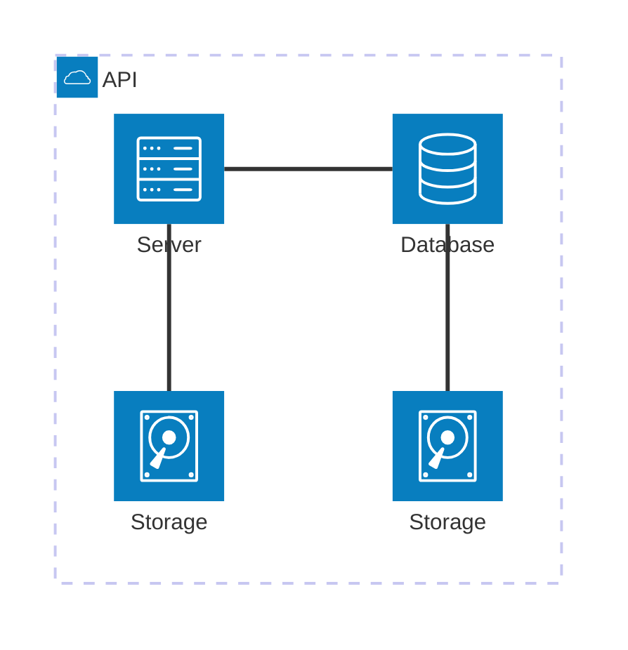

# Diagrama de Arquitetura

O presente diagrama tem como objetivo espeficicar a estrutura de aplicação do sistema suporte-flow. Observer a infra abaixo.

```mermaid
architecture-beta
    group api(cloud)[API]

    service db(database)[Database] in api
    service disk1(disk)[Storage] in api
    service disk2(disk)[Storage] in api
    service server(server)[Server] in api

    db:L -- R:server
    disk1:T -- B:server
    disk2:T -- B:db

```